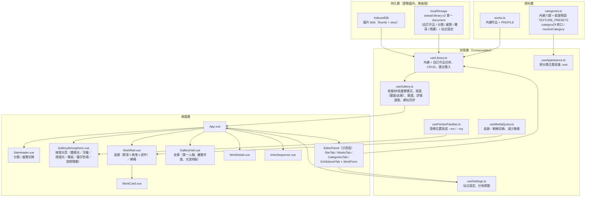

# 系統架構文件

## 系統架構圖

## 模組職責

| 模組 | 職責 | 不負責 |
|------|------|--------|
| `data/works.ts` | 內建作品資料與作者預設值 | 使用者的編輯結果 |
| `data/categories.ts` | 內建六類 + 紋理預設 `TEXTURE_PRESETS`；`categoryOf`（分類讀取唯一收口，孤兒回中性 fallback）、`resolveCategory`（自訂分類算完整 theme） | 中性層 token（寫死在 `styles/main.css`） |
| `composables/useLibrary.ts` | 作品／分類／展覽的合併與 CRUD、單一 document 持久化與 v1→v2 遷移、匯出匯入 | 篩選與選取 |
| `composables/useGallery.ts` | 依媒材/依展覽模式、**版面（牆面／走廊）**、篩選與詳情選取、網址同步 | 資料從哪來 |
| `components/GalleryHall.vue` | 走廊模式的房間（四個面）、相機推進、光波地板、近景換大圖 | 幾何算式（在 `utils/hall.ts`）、誰能進走廊（由 `App.vue` 判定） |
| `utils/hall.ts` | 走廊的純幾何：步數夾制、相機位置、作品掛在哪面牆與多深、近景／可見窗口判定、**房間長度 `roomSpan(total)`** | DOM 與樣式 |
| `composables/useAppearance.ts` | 分類主題（含光色 `--accent`／疊印色 `--counter`）寫進 `:root` | 決定用哪個主題 |
| `composables/usePointerParallax.ts` | 游標位置正規化成 `--mx` / `--my` 寫進 `:root` | 誰要吃這兩個值 |
| `composables/usePointerAfterimage.ts` | 游標殘像的兩組座標與淡出旗標寫進 `:root`（`--trail-*`） | 殘像長什麼樣（在光氛層的 CSS） |
| `utils/motion.ts` | 互動動態的共用數學：`lerp`、拖曳速度→套色錯位倍率 `misregFor` | 誰在什麼時候呼叫 |
| `composables/useImageZoom.ts` | 詳情頁的縮放與平移：上限換算（原圖像素 1:1）、錨點與邊界夾制、滑鼠／觸控手勢 | 圖從哪來、框多大（由 `WorkDetail` 的版面決定） |
| `components/GalleryAtmosphere.vue` | 暗場光氛八層（主光暈／體積光／浮塵／霧氣／掃描光／暗角＋疊印色場／游標殘像） | 作品本身的呈現 |
| `composables/useSettings.ts` | 站台設定與分頁標題 | 作品資料 |
| `utils/color.ts` | 由 accent 以 HSL 推導暗底 `accentDark`、疊印第二色版 `counterAccent`、對比度計算 | 顏色語意以外 |
| `utils/image.ts` | 壓縮成縮圖／詳情用圖、比例偵測 | 儲存 |
| `utils/idb.ts` | IndexedDB 存取 | 資料語意 |
| `utils/placeholder.ts` | 幾何佔位圖 | 真實圖片 |

## 資料流

### 讀取

1. `useLibrary.init()` 讀 localStorage 的 `artwall.library.v2` document；無 v2 但有舊 `works/overrides/hidden.v1` 三 key 時自動遷移組出並寫回（**不刪舊 key**，可回滾；v2 已存在則不重跑）
2. 依 `imageKey` 從 IndexedDB 取出 blob，`createObjectURL` 接回 `thumb` / `src`
3. `allWorks` = 自訂作品（在前）+ 內建作品（套用覆寫、排除隱藏）；`categories` = 內建六類 + 自訂分類
4. `useGallery` 依模式篩選——依媒材＝`activeCategory`，依展覽＝該展覽 `workIds` 的有序清單
5. 版面決定由誰渲染：`layout === 'hall'` 且未要求減少動態 → `GalleryHall`，否則 `WorkRail`。
   **版面與篩選是兩個正交的軸**（`?v=hall` 與 `?c=` / `?m=ex` 可並存），切版面不會洗掉篩選

### 寫入（上傳）

1. `WorkForm` 選檔 → `detectAspect()` 立即把版位帶進表單
2. 送出 → `processImage()` 壓成 thumb（800px）與 view（1800px）
3. 兩份 blob 寫進 IndexedDB（`<id>-thumb` / `<id>-view`）
4. metadata（不含 blob URL）寫進 localStorage
5. 內建作品的編輯不改原始資料，只疊一層 `overrides`，可還原

## 主題系統：固定暗場 + 分類層

原本是兩層正交（整體背景四選一 × 分類主題，MR-009）。**MR-014 收成一層**：
站台一律是暗場光氛，中性層不再是執行期可換的狀態。

| 層 | 來源 | 控制的 CSS 變數 |
|----|------|----------------|
| 中性層（固定） | `styles/main.css` 的 `:root` | `--bg` `--surface` `--ink` `--ink-soft` `--ink-faint` `--line` `--line-strong` |
| 分類層（可換） | `categories.ts` → `useAppearance` | `--accent` `--counter` `--texture` `--ease` `--card-radius` `--card-border` |

`--accent` 一律取分類的 `accentDark`（底永遠是暗的），它同時是**光氛的光色**：
主光暈、體積光、聚光、光池、疊印框、站頭光暈全部吃這個值，所以它必須有彩——
無彩 accent 在暗場只會糊成一團灰霧（書法／立體因此於 MR-014 改為印泥朱紅／陶土赭）。
`--counter` 是疊印框的第二色版，由 `counterAccent` 推開 156 度色相算出。

內建六類的 `accentDark` 手工調校；使用者自訂分類由 `utils/color.ts` 從 accent 自動推導，
並驗證對暗場底（`#08080d`）的對比度達 WCAG AA。

背景紋理鋪在 `body::before` 獨立圖層並整層 `filter: invert(1)`——
紋理是黑線，不反相在暗底就看不見。

游標視差由 `usePointerParallax` 寫成 `--mx` / `--my`（-1～1）：光氛層與長廊都直接吃根節點
的這兩個值，不逐層傳 props——「整個空間一起偏」本來就是根節點層級的事。

## 疊印視覺（MR-016）

Risograph 的四個機制，全部落在**作品以外**——這是「要印刷質感」與 MR-008／MR-014
「作品圖面不覆蓋任何色層」唯一不打架的界線（見 `prepare.md` 待討論 #5 的收斂）。

| 機制 | 實作 | 界線與代價 |
|------|------|-----------|
| 顆粒 | `body::after` 鋪一張 feTurbulence 靜態噪點（`baseFrequency` 0.7），`mix-blend-mode: overlay`、opacity 0.9 | z-index -1＝畫在光之上、**所有內容之下**，顆粒落在牆面不落在作品。零動畫，只光柵化一次 |
| 疊印色場 | 光氛層三顆 `blur(48px)` 色圓（accent 46%／32%、counter 42%），34～47s 各自漂移 | 呼吸用 `opacity` 不用 `scale`——縮放會逼模糊層每帧重新光柵化。動 `translate` 獨立屬性，把 `transform` 留給視差 |
| 游標殘像 | `usePointerAfterimage` 每帧 lerp 出快慢兩組座標（0.22／0.10）寫成 `--trail-*`，停 0.7s 後 `--trail-on` 歸零 | **自成 `z-index: 40` 一層、不在光氛層內**：光氛是 `z-index: -1` 的堆疊脈絡，放裡面會被作品蓋掉，而長廊上作品佔掉大半畫面。40 在詳情頁（80）之下。只掛 `mousemove`，rAF 追上且閒置時自行收掉；`@media (hover: none)` 擋掉觸控裝置 |
| 拖曳套色錯位 | 長廊拖曳速度 → `misregFor()` → 軌道上的 `--misreg`，卡片兩塊疊印光版的位移乘上它 | 拖曳中拿掉過渡（否則慢半拍），放手回到 1 就自然彈回；`prefers-reduced-motion` 下整條不啟用 |

## 長廊的景深與互動（MR-014）

| 機制 | 實作 | 為什麼 |
|------|------|--------|
| `--focus`（0～1） | `WorkRail.measure()` 每帧算「距軌道中心的距離」寫在 `<li>` 上 | 一個值同時驅動偏轉、退遠、變暗、光池與聚光強度 |
| 牆面偏轉 | 三張一循環 `--yaw` ±7deg，乘上 `1 - --focus` | 走到正前方自動轉正，不需 hover |
| 景深遞減 | `translateZ(--depth + --focus × 36px)`，透明度下限 0.74 | 低於 0.74 會從「有距離」變成「蒙了灰」 |
| 走道盡頭 | 軌道兩端 `mask-image` 漸隱 | 比再加一層透視線更省，也更像展場 |
| 拖曳 | `pointerdown` 後在 **window** 上聽 move／up，超過 6px 才算拖曳 | `setPointerCapture` 會把 `click` 一起改派給軌道，作品就點不開了 |
| 逐件停留 | 方向鍵／Home／End → `centreOn()` 捲到該件置中 | 原生方向鍵是「捲固定像素」，會停在兩件之間 |

## 版面尺寸的唯一真相

| 模式 | 尺寸來源 | 說明 |
|------|---------|------|
| 長廊（≥900px） | 軌道高度 | 卡片高 → 圖框高 → 由 `aspect-ratio` 反推圖框寬 → 卡片寬。說明文字絕對定位，不參與寬度計算 |
| 網格（<900px） | 欄寬 | 圖框寬 100% → 由 `aspect-ratio` 推得高度 |
| 走廊（選配，全尺寸） | **掛畫高度** | 作品鎖高不鎖寬，共用一條掛畫線、寬度各自不同（實體展場的掛法，不裁切）。房間四個面與作品都在 3D 場景內，`transform` 不改 layout box，故不參與版面計算。窄螢幕只收窄走廊半寬與掛畫高度，**幾何與相機不變** |

三種模式都不讓圖片的固有尺寸參與版面計算，這是「圖片不會撐破版面」的根本原因。

**走廊的垂直尺度是一組必須對齊的常數**（`GalleryHall.vue` 的 `--ceil` / `--ground`）：
天花板、兩道牆、地板共用同一條天際線與地平線，改一個就要改全部，否則牆會穿到
地板以下、在外側露出黑色梯形。四個面另往觀者方向延伸 `--behind`，
少了那一段，畫面四角會露出底下的光氛層。

**房間跟著相機走**：四個面各前置 `translateZ(calc(var(--cam) * -1))` 抵銷場景位移，
長度固定 5200px，近端固定在相機前方 `--near`（560px，必須 < `perspective` 620）。

這不是效能優化，是**正確性**。第一版讓房間跟著場景後退、長度依件數算到 9250px，
走到第 14 件時相機推進 5980，四個面同時**橫跨相機平面**——而 CSS 3D **沒有近平面裁切**，
元素一跨越相機平面，整塊的投影就壞掉。實測是地板、天花板、兩道牆全部消失，
只剩一件作品飄在暗處（光波畫在地板上，地板沒了自然也沒了）。

走廊沿長度是均勻重複的紋理，所以看不出房間沒有後退；**移動感由作品位移與地板光波提供**，
不是由牆面提供。

**走廊裡 `.piece` 的 `width` 不是畫面上的寬**：牆已經 `rotateY(90deg)`，元素的 width
其實是**沿走廊的長度**。所以鎖 width 會讓橫幅被壓扁、直幅拉高，整條走廊看起來全是直的；
改為鎖 `.piece__image` 的高度（`--piece-h`）、寬度 `auto`，橫幅才會占掉較長一段牆面。

**詳情頁是例外，也只有這一處**：`.detail__viewport` 貼著圖片的實際尺寸收縮
（圖受 `max-height: 60vh` / 手機 46vh 約束），放大後溢出的部分裁在這個框內。
放大上限＝原圖像素 1:1，由 `naturalWidth ÷ 顯示寬度` 算出——詳情用圖長邊 1800px
（`utils/image.ts`），超過 1:1 只會放大 JPEG 的壓縮痕跡。手機未放大時
框上是 `touch-action: pan-y`，單指仍然捲得動面板；放大後才改 `none` 由手勢接管。

## 技術棧

- Vue 3（`<script setup>`）+ TypeScript + Vite
- 樣式：CSS Variables，無 UI 框架、無動畫函式庫
- 儲存：localStorage（`artwall.library.v2` 單一 document + 站台設定）+ IndexedDB（圖片 blob），無後端
- 檢查：ESLint 9 + typescript-eslint + eslint-plugin-vue
